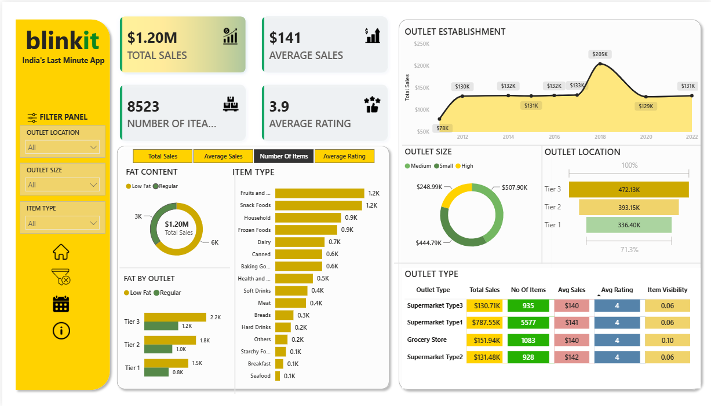

# BlinkIT_data_analysis
Interactive Power BI dashboard analyzing BlinkIT grocery sales data to uncover insights on product performance, outlet efficiency, sales trends, and customer ratings.

# 📊 BlinkIT Grocery Sales Analysis Dashboard | Power BI Project

## 🚀 Project Overview

This project presents a comprehensive sales analysis dashboard for BlinkIT, India's leading quick-commerce grocery delivery platform. The dashboard was developed using Power BI to transform raw sales data into actionable business insights.

The project focuses on analyzing product performance, outlet efficiency, customer ratings, and sales trends through interactive visualizations and KPI tracking. Data cleaning and preprocessing were performed using Python before importing the dataset into Power BI.

---

## 🎯 Business Objective

The primary objective of this project is to:

* Monitor overall sales performance
* Analyze customer purchasing behavior
* Identify top-performing product categories
* Compare outlet performance across different locations and sizes
* Track business growth trends over time
* Support data-driven decision-making through interactive reporting

---

## 📂 Dataset Information

The dataset contains grocery sales transactions from BlinkIT.

### Dataset Summary

* Total Records: 8,523
* Total Columns: 12
* File Format: Excel (.xlsx)

### Dataset Features

| Column Name               | Description                  |
| ------------------------- | ---------------------------- |
| Item Identifier           | Unique product code          |
| Item Weight               | Weight of the product        |
| Item Fat Content          | Low Fat or Regular           |
| Item Visibility           | Product visibility score     |
| Item Type                 | Product category             |
| Sales                     | Revenue generated            |
| Rating                    | Customer rating              |
| Outlet Identifier         | Unique outlet code           |
| Outlet Establishment Year | Year outlet was established  |
| Outlet Size               | Small, Medium, High          |
| Outlet Location Type      | Tier 1, Tier 2, Tier 3       |
| Outlet Type               | Supermarket or Grocery Store |

---

## 🐍 Data Cleaning & Preprocessing

The dataset was cleaned and prepared using Python before loading it into Power BI.

### Libraries Used

* Pandas
* NumPy

### Data Cleaning Steps

✔ Handled missing values

✔ Standardized inconsistent values

* LF → Low Fat
* REG → Regular

✔ Checked data quality and consistency

✔ Validated data types

✔ Removed duplicate records (if any)

✔ Performed exploratory analysis

✔ Prepared dataset for visualization

---

## 📈 Key Performance Indicators (KPIs)

The dashboard tracks the following business KPIs:

### 💰 Total Sales

Measures the total revenue generated from all products sold.

```DAX id="lq8q29"
Total Sales = SUM(BlinkIT[Sales])
```

### 📊 Average Sales

Measures the average revenue per transaction.

```DAX id="w3y42f"
Average Sales = AVERAGE(BlinkIT[Sales])
```

### 📦 Number of Items Sold

Counts the total number of items sold.

```DAX id="gl7n4y"
Number of Items = COUNTROWS(BlinkIT)
```

### ⭐ Average Rating

Calculates average customer rating.

```DAX id="mkt1q4"
Average Rating = AVERAGE(BlinkIT[Rating])
```

---

## 📊 Dashboard Features

### 1. KPI Cards

Displays:

* Total Sales
* Average Sales
* Number of Items Sold
* Average Rating

---

### 2. Fat Content Analysis

**Visualization:** Donut Chart

Analyzes:

* Low Fat Products
* Regular Products

Metrics:

* Total Sales
* Average Sales
* Item Count
* Average Ratings

---

### 3. Item Type Analysis

**Visualization:** Bar Chart

Compares sales across categories such as:

* Fruits & Vegetables
* Snacks Foods
* Dairy
* Household
* Soft Drinks
* Frozen Foods
* Baking Goods

---

### 4. Fat Content by Outlet

**Visualization:** Clustered Bar Chart

Shows sales contribution of Low Fat and Regular products across different outlet locations.

---

### 5. Outlet Establishment Trend

**Visualization:** Line Chart

Analyzes sales performance based on outlet establishment year.

---

### 6. Outlet Size Analysis

**Visualization:** Donut Chart

Compares sales generated by:

* Small Outlets
* Medium Outlets
* High Outlets

---

### 7. Outlet Location Analysis

**Visualization:** Funnel Chart

Analyzes sales distribution across:

* Tier 1 Cities
* Tier 2 Cities
* Tier 3 Cities

---

### 8. Outlet Type Analysis

**Visualization:** Matrix Table

Provides outlet-wise comparison of:

* Total Sales
* Average Sales
* Number of Items
* Average Ratings

---

## 🎛 Interactive Dashboard Features

### Filters & Slicers

Users can filter data by:

* Outlet Location Type
* Outlet Size
* Item Type

### Cross Filtering

* Clicking any visual filters the entire dashboard.
* Allows deeper analysis and exploration.

### Dynamic Reporting

* Interactive KPI tracking
* Responsive dashboard navigation
* User-friendly interface

---

## 📌 Key Insights

### Sales Performance

* Total Sales exceeded **$1.2 Million**
* Average Sales per transaction were approximately **$141**

### Customer Satisfaction

* Average Rating was approximately **3.9/5**

### Product Insights

* Low Fat products generated higher sales than Regular products.
* Fruits & Vegetables were the most purchased category.
* Household items showed strong average sales performance.

### Outlet Insights

* Tier 3 cities generated the highest sales volume.
* Medium-sized outlets produced the highest revenue.
* Outlets established after 2018 showed stronger performance.

---

## 🛠 Tools & Technologies Used

### Programming

* Python
* Pandas
* NumPy

### Data Visualization

* Power BI Desktop
* DAX (Data Analysis Expressions)

### Data Sources

* Microsoft Excel

---

## 💡 Skills Demonstrated

* Data Cleaning
* Data Preprocessing
* Exploratory Data Analysis (EDA)
* Pandas Data Manipulation
* Data Visualization
* Power BI Dashboard Development
* DAX Measures
* Business Intelligence
* KPI Design
* Insight Generation
* Interactive Reporting

---

## 📷 Dashboard Preview

(Add your dashboard screenshot here)

```markdown

```

---

## 🎯 Project Outcome

This project demonstrates how raw business data can be transformed into meaningful insights using Python and Power BI. The dashboard enables stakeholders to monitor sales performance, evaluate outlet efficiency, understand customer preferences, and make informed business decisions through interactive analytics.

---

## 👨‍💻 Author

Sanchita Kore

Aspiring Data Analyst | Power BI Developer | Python Enthusiast

